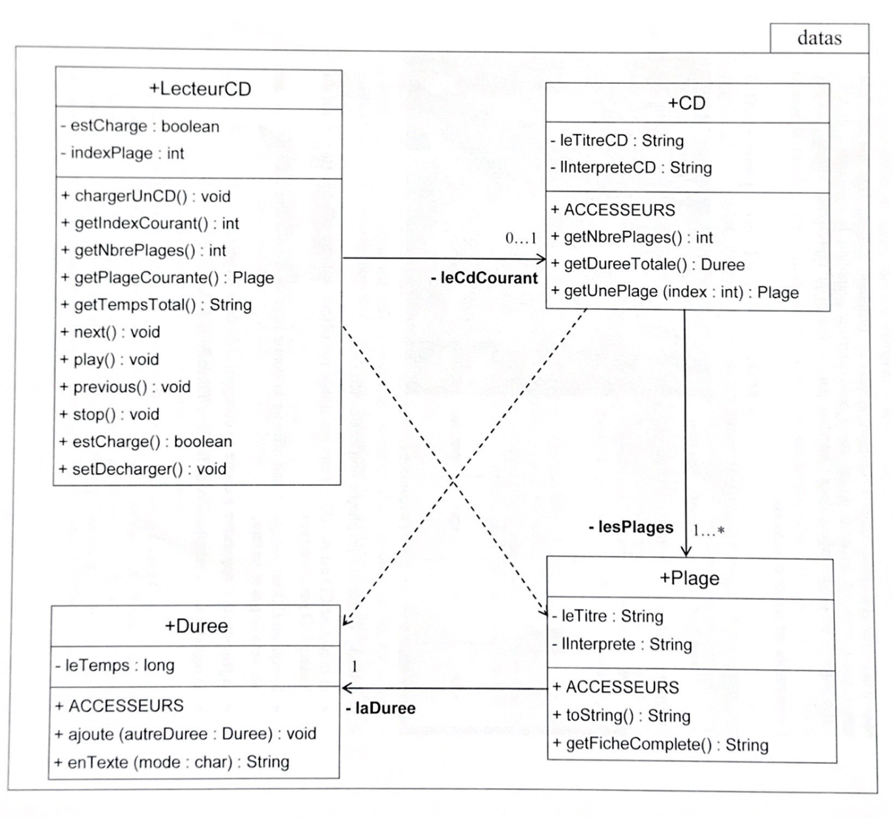

 

    
     
     
    <h1 align="center">TP Java</h1>

  

    Simulation graphique du fonctionnement d'un lecteur de CDs 
     (Licence Pro DLIS)
     
  

 
 

<!-- TABLE OF CONTENTS -->

  
Table of Contents

  <ol>
    <li><a href="#illustrations">Illustration</a></li>
    <li><a href="#description">Description</a></li>
    <li><a href="#langages">Langages et outils</a></li>
    <li><a href="#objectifs">Objectifs</a></li>
    <li><a href="#uml">Diagramme UML</a></li>
    <li><a href="#statut">Statut</a></li>
    <li><a href="#contexte">Contexte</a></li>
  </ol>

 
 

## ✨ Illustrations 
...

## 🗒 Description 
Cette application Java simule visuellement le fonctionnement d'un lecteur CD. 
L'application graphique, volontairement simple, permet à l'utilisateur d'effectuer les opérations suivantes :
- chargement d'un CD dans le lecteur
- lecture du CD depuis le début
- arrêt de la lecture
- passage au morceau suivant
- passage au morceau précédent

## 🛠 Langages/Outils 
- Java

## 🎯 Objectifs 
- Organisation du code en Package
- Respect des règles de style Java
- Ecriture d'une documentation embarquée JavaDoc
- Modèle MVC
- Règles de visibilité (public, private, package, protected)
- Clean architecture

## ➡️ Diagramme UML 

## 📈 Statut 

Application en cours de réalisation

## 🗓 Contexte 

Cette application est réalisée lors de ma licence pro DLIS (IUT Vannes)

