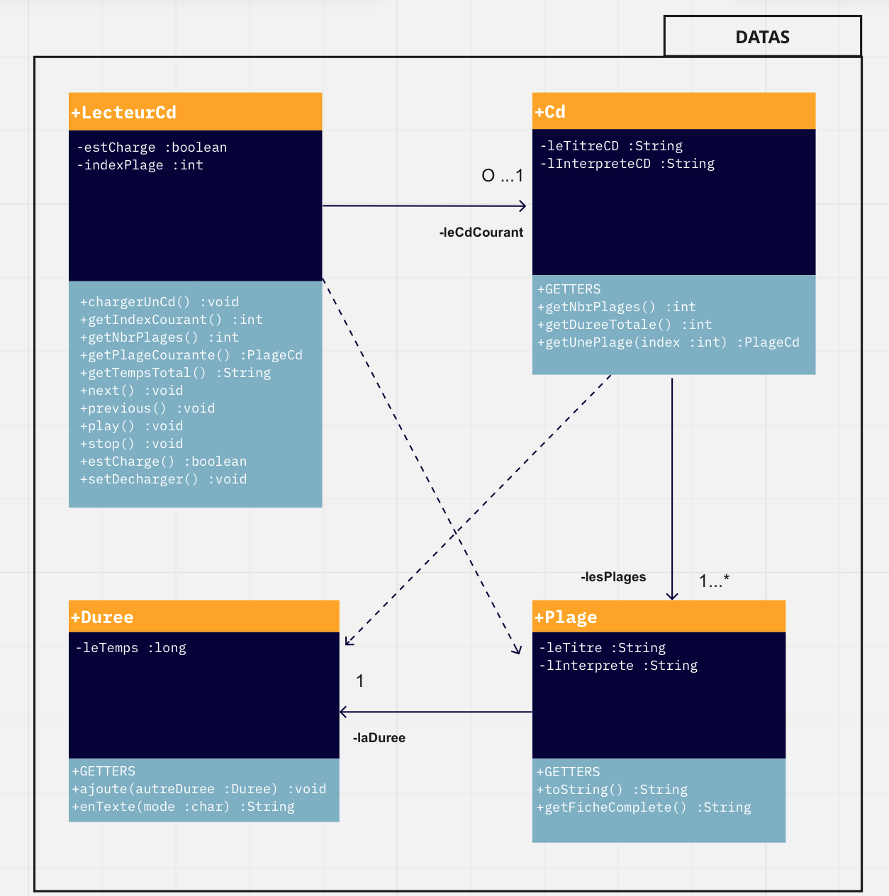

[](https://)
[](https://)
[](https://)


<br/>
<div align="center">
    
    <br/>
    <br/>
    <h1 align="center">Java App</h1>
</div>
  <h3 align="center">
    Graphical simulation of a CD player
  </h3>
<br/>


<br/>
<br/>

<!-- TABLE OF CONTENTS -->
<details open="open">
  <summary>Table of Contents</summary>

  <ol>
    <li><a href="#illustration">Illustration</a></li>
    <li><a href="#description">Description</a></li>
    <li><a href="#langages">Languages</a></li>
    <li><a href="#objectifs">Objectives</a></li>
    <li><a href="#uml">UML diagram</a></li>
    <li><a href="#setup">Setup</a></li>
    <li><a href="#statut">Status</a></li>
    <li><a href="#contexte">Context</a></li>
  </ol>
</details>

<br>
<br>


## ✨ Illustration <a id="illustration"></a>


## 🗒 Description <a id="description"></a>
This Java application visually simulates the operation of a CD player.
The graphical interface, intentionally simple, allows the user to perform the following operations:
- loading a CD into the player
- play the CD from the beginning
- stop playing
- skip to next track
- skip to previous track


## 🛠 Languages <a id="langages"></a>
- Java
- Swing


## 🎯 Objectives <a id="objectifs"></a>
- Organisation in Package
- Respect of Java style rules
- Writing of JavaDoc
- MVC model
- Rules of visibility(public, private, package, protected)
- Clean architecture

## ➡️ UML diagram <a id="uml"></a>


## ⚙️ Setup <a id="setup"></a>
Pour lancer l'affichage du lecteur, se positionner dans le répertoire ws
```java
javac -d ../class ../src/ihm/GUILecteurCd.java ../src/control/Ecouteur.java ../src/datas/*.java
java ihm/GUILecteurCd
```


## 📈 Status <a id="statut"></a>

Project completed


## 🗓 Context <a id="contexte"> </a>

I realized this application during my bachelor of computer science in the Institute of technology (Vannes)
